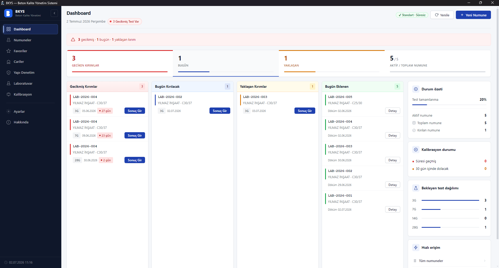
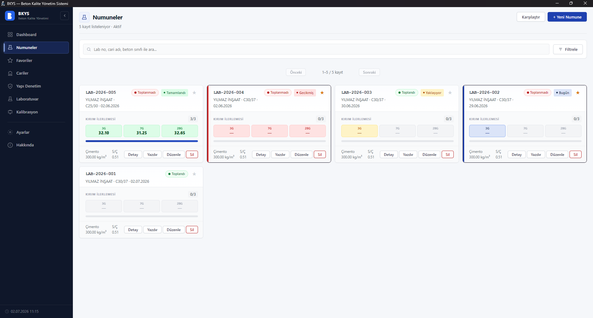
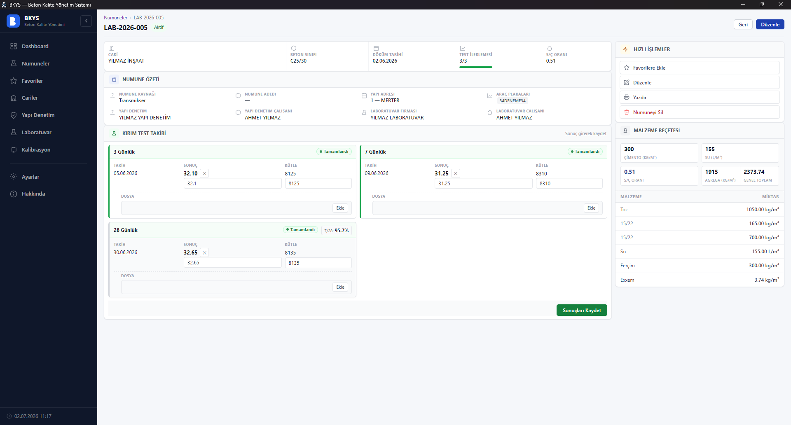
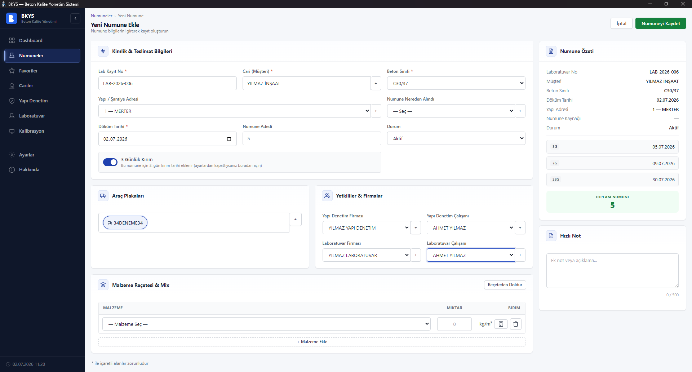
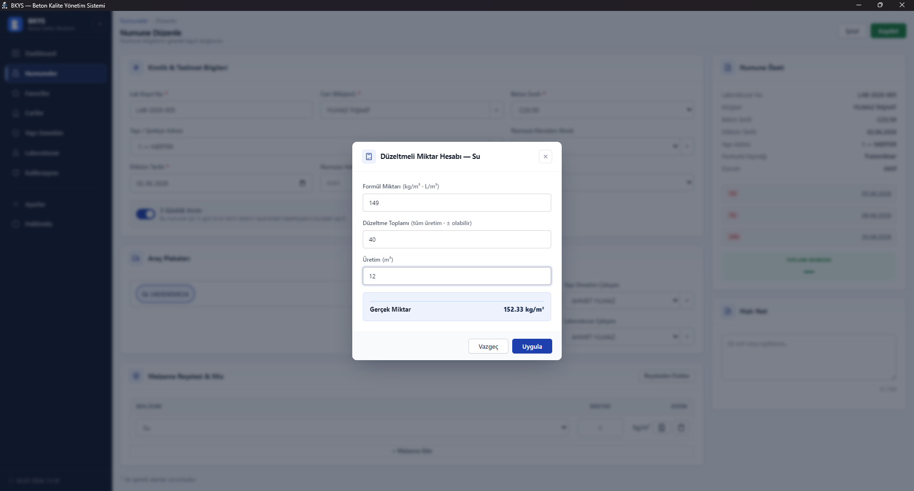
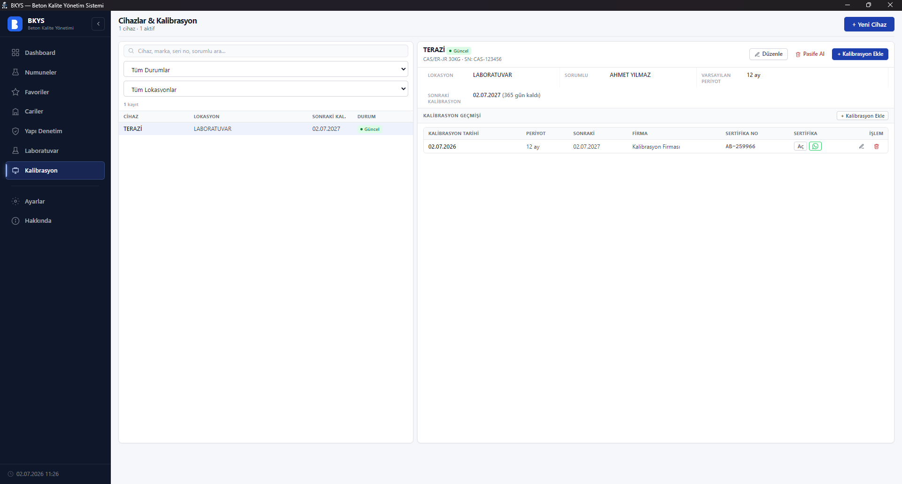
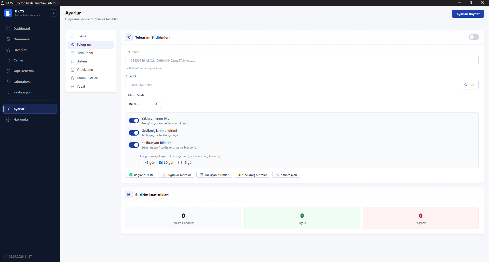
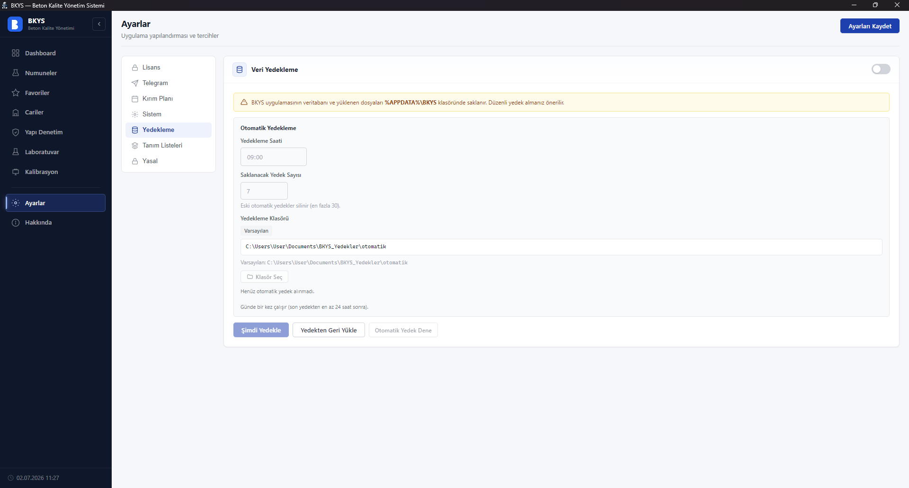

# 🧱 BKYS — Beton Kalite Yönetim Sistemi

### Hazır beton santralleri ve yapı laboratuvarları için tasarlanmış, Excel karmaşasına son veren masaüstü kalite yönetim yazılımı.

Numune kaydı · 3/7/14/28 günlük kırım planı · reçete yönetimi · cari ve yapı denetim takibi · cihaz kalibrasyonu · otomatik hatırlatmalar · tek tıkla PDF rapor.

### [⬇️ En Son Sürümü İndir](https://github.com/farklibeyinler/BKYS-SETUP/releases/latest)

---

## 📌 BKYS Nedir?

**BKYS (Beton Kalite Yönetim Sistemi)**, hazır beton üreticilerinin ve yapı malzemesi laboratuvarlarının günlük kalite kontrol işlerini tek bir programda toplayan bir **Windows masaüstü uygulamasıdır**. Beton numunelerinin alınmasından kırım tarihlerinin hatırlatılmasına, reçete takibinden cihaz kalibrasyonuna kadar tüm süreç TS EN 206 mantığına uygun biçimde yönetilir.

Verileriniz **kendi bilgisayarınızda** (yerel veritabanı) saklanır — buluta bağımlılık yok, aylık abonelik yok, internet olmadan da çalışır.

> **Kısaca:** Dağınık Excel dosyaları, unutulan kırım tarihleri ve elle hesaplarla uğraşmayı bırakın.

---

## 📷 Ekran Görüntüleri

<em>Dashboard — bugünkü / yaklaşan / geciken kırımlar, KPI'lar ve kalibrasyon durumu tek ekranda.</em>

 

| Numune Listesi | Numune Detayı |
|:---:|:---:|
|  |  |
| Her numunede kırım ilerlemesi ve durum rozetleri. | Kırım sonuçları (dayanım/kütle) ve malzeme reçetesi. |

| Yeni Numune Ekleme | Düzeltmeli Miktar Hesabı |
|:---:|:---:|
|  |  |
| Kimlik, plaka, yetkili, reçete ve otomatik kırım tarihleri. | Santral düzeltmesine göre m³ başına gerçek miktar (Excel'de yok!). |

| Cihaz / Kalibrasyon Takibi | Telegram Bildirimleri |
|:---:|:---:|
|  |  |
| Kalibrasyon geçmişi ve yaklaşan kalibrasyon uyarısı. | Yaklaşan/gecikmiş kırım ve kalibrasyon uyarıları telefonunuza. |

<em>Otomatik yedekleme — zamanlanmış yedek, güncelleme öncesi güvenlik yedeği ve tek tıkla geri yükleme.</em>

---

## ⭐ Neden BKYS? (Excel yerine)

Çoğu beton firması kalite kayıtlarını Excel makrolarıyla tutar. Excel esnektir ama büyüdükçe **formüller bozulur, tarihler unutulur, veri kaybolur ve raporlama zaman alır.** BKYS bu işi yapılandırılmış, hatasız ve hatırlatmalı hâle getirir:

| İhtiyaç / Özellik | 📄 Excel | 🧱 BKYS |
|---|:---:|:---:|
| Numune kaydı | Manuel satır, kopyala-yapıştır | ✅ Yapılandırılmış, doğrulamalı form |
| Kırım tarihleri (3/7/14/28 gün) | Elle hesap, **unutma riski** | ✅ Otomatik hesap |
| Kırım hatırlatma / bildirim | ❌ Yok | ✅ Telegram + uygulama içi bildirim |
| Reçete yönetimi | Dağınık sayfalar | ✅ Merkezi reçete kataloğu |
| Düzeltmeli miktar hesabı (± santral düzeltmesi) | Elle formül | ✅ Dahili hesap makinesi |
| Malzeme kategorileri & malzeme bazlı arama | Sınırlı | ✅ Kategorili, güçlü arama |
| Cari / yapı denetim takibi | Ayrı ayrı dosyalar | ✅ Entegre modüller |
| Cihaz kalibrasyon takibi | ❌ Yok / ayrı liste | ✅ Süre takibi + yaklaşan uyarısı |
| Numune karşılaştırma | Elle uğraş | ✅ Yan yana karşılaştırma + PDF |
| Raporlama / PDF | Elle biçimlendirme | ✅ Tek tıkla profesyonel PDF |
| Veri güvenliği / yedekleme | Dosya kaybı riski | ✅ Otomatik + güncelleme öncesi yedek |
| Çok kişi kullanınca hata | Yüksek (formül bozulur) | ✅ Düşük (yapılandırılmış veri) |
| Güncelleme bildirimi | ❌ Yok | ✅ Yeni sürüm otomatik bildirilir |

---

## 🚀 Öne Çıkan Özellikler

- **📊 Dashboard & KPI Takibi** — Bugün kırılacak, yaklaşan ve geciken numuneler tek ekranda.
- **🧪 Beton Numune Yönetimi** — TS EN 206 mantığıyla numune kaydı, çoklu küp ortalaması.
- **📅 3/7/14/28 Günlük Kırım Planı** — Döküm tarihinden otomatik plan; hiçbir kırımı kaçırmayın.
- **📈 Numune Karşılaştırma** — Birden çok numuneyi yan yana kıyaslayın, PDF alın.
- **📐 Reçete Yönetimi & Malzeme Kategorileri** — Kayıtlı reçeteler, çimento/katkı/agrega/su kategorileri.
- **➗ Düzeltmeli Miktar Hesabı** — Santral düzeltmesine göre (± olabilir) m³ başına gerçek miktar.
- **🔍 Malzeme Bazlı Arama & Filtreleme** — Cari, tarih, malzeme adına göre hızlı erişim.
- **🏢 Cari & Yapı Denetim Yönetimi** — Müşteri, şantiye adresi ve yapı denetim kayıtları.
- **🔧 Cihaz / Kalibrasyon Takibi** — Kalibrasyon süreleri, yaklaşan kalibrasyon uyarıları.
- **🚚 Araç Plaka Takibi** — Numuneye bağlı transmikser plakaları.
- **🔔 Telegram Bildirimleri** — Günün kırımları ve gecikmeler telefonunuza.
- **🖨️ PDF Yazdırma** — Profesyonel numune ve karşılaştırma raporları.
- **💾 Otomatik Yedekleme** — Zamanlanmış yedek + güncelleme öncesi güvenlik yedeği.
- **🔄 Otomatik Güncelleme Bildirimi** — Yeni sürüm çıkınca uygulama sizi uyarır.

---

## 👥 Kimler İçin?

- Hazır beton santralleri ve şantiye laboratuvarları
- Yapı malzemesi test laboratuvarları
- Kalite kontrol ve kalibrasyon sorumluları
- Beton numune kırım süreçlerini takip eden mühendisler

---

## ⬇️ Kurulum

1. [**En son sürümü indirin**](https://github.com/farklibeyinler/BKYS-SETUP/releases/latest) (`BKYS Setup x.x.x.exe`).
2. İndirilen `.exe` dosyasını çalıştırın ve kurulum adımlarını izleyin.
3. Uygulama ilk açıldığında **Makine Kodunuz** oluşturulur; lisans için bu kodu bize iletin.
4. Size özel lisans dosyasını (`.lic`) **Ayarlar → Lisans** bölümünden yükleyin — hazırsınız.

> 💡 Yeni sürümler çıktığında uygulama sizi otomatik bilgilendirir; güncellemeyi buradan indirip üzerine kurmanız yeterlidir. **Verileriniz korunur** (güncelleme öncesi otomatik yedek alınır).

---

## 💻 Sistem Gereksinimleri

| | |
|---|---|
| **İşletim Sistemi** | Windows 10 / 11 (64-bit) |
| **Disk** | ~250 MB boş alan |
| **İnternet** | Yalnızca lisanslama, güncelleme ve (isteğe bağlı) Telegram bildirimleri için |
| **Veritabanı** | Yerel SQLite — verileriniz kendi bilgisayarınızda |

---

## 🔐 Lisans ve Fiyatlandırma

BKYS ticari bir yazılımdır ve makineye bağlı lisans (`.lic`) ile çalışır. **Demo, Standart ve Ömür Boyu** lisans seçenekleri mevcuttur. Lisans ve fiyat bilgisi için iletişime geçin.

Kişisel verilerin korunması (KVKK) ve son kullanıcı lisans sözleşmesi (EULA) metinleri uygulama içinde **Ayarlar → Yasal** bölümünde yer alır.

---

## 📞 İletişim & Destek

| | |
|---|---|
| **Osman Soylu** | 📱 0544 968 19 83 |

Lisans talebi, demo isteği ve teknik destek için yukarıdaki numaradan ulaşabilirsiniz.

---

**BKYS** · Beton Kalite Yönetim Sistemi · Windows Masaüstü Uygulaması
© 2026 · Tüm hakları saklıdır.

